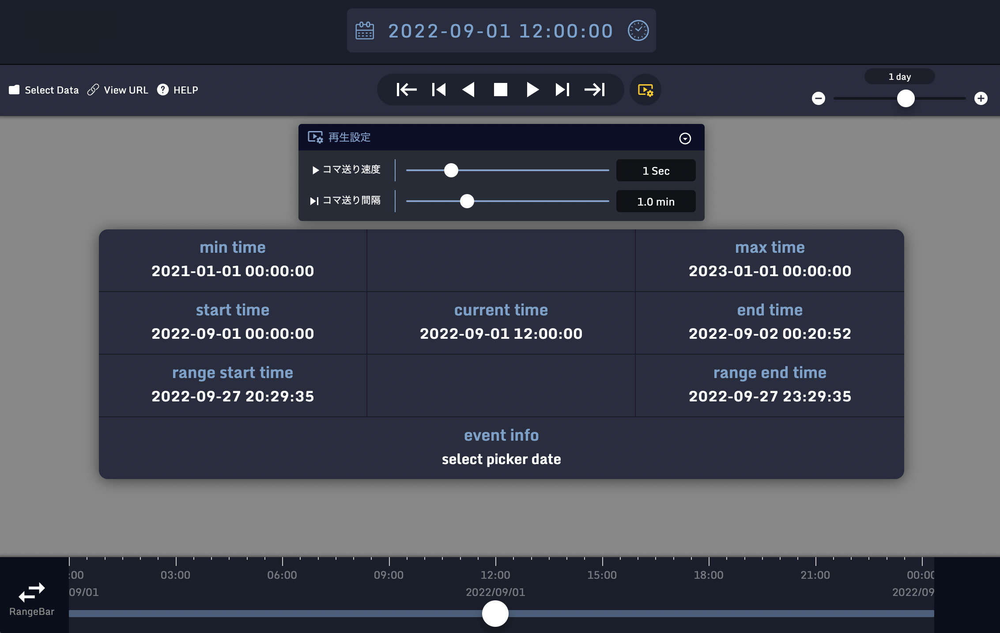

# Timeline
### 概要
Webページに時間軸バーを簡単に組み込む事が出来るjQueryプラグインです。

 

------------

### ドキュメント
https://nict-stars.github.io/Timeline/

------------

### ライセンス

BSD2

------------

### 主な機能

- 左端の日時、右端の日時、摘み（ポインタ）の日時を任意に指定して時間軸バーを描画出来ます。
- 時間軸バーや摘み（ポインタ）は左右にドラッグ出来ます。
- マウスの左ダブルクリックでズームイン、右クリックでズームアウト出来ます。
- マウスホイールでズームイン・アウト出来ます。
- タッチデバイスではピンチ操作でズームイン・アウト出来ます。
- 再生機能で自動スクロールが出来ます。

------------

### 導入方法

1. ライブラリをダウンロードする。
  - jquery-k2go-timeline.cssとjquery-k2go-timeline-pick.pngは同じディレクトリに配置して下さい
2. jquery（Ver3.4.1以上）とダウンロードしたライブラリをHTMLファイルへ組み込む。
3. windowオブジェクトのload完了後、時間軸バーを組み込みたい要素へ実装する。
