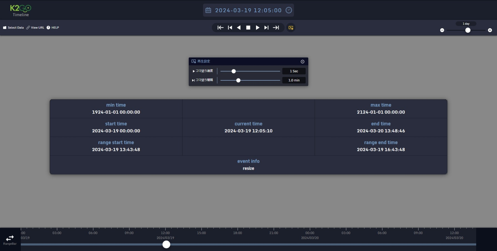

# Timeline
### 概要
Webページに時間軸バー、ヘッダーパーツを簡単に組み込む事が出来るWeb Componentsプラグインです。

 

------------

### ドキュメント
https://nict-stars.github.io/Timeline/

------------

### ライセンス

BSD2

------------

### 主な機能
#### 時間軸バー
- 左端の日時、右端の日時、摘み（ポインタ）の日時を任意に指定して時間軸バーを描画出来ます。
- 時間軸バーや摘み（ポインタ）は左右にドラッグ出来ます。
- マウスの左ダブルクリックでズームイン、右クリックでズームアウト出来ます。
- マウスホイールでズームイン・アウト出来ます。
- タッチデバイスではピンチ操作でズームイン・アウト出来ます。
- レンジバーを表示し、再生機能で再生できる範囲を指定することが出来ます。

#### ヘッダーパーツ
- 摘み（ポインタ）で取得した日時をヘッダーパーツに表示できます。
- カレンダーで指定した年月日の情報をヘッダーパーツおよび、時間軸バーに反映することが出来ます。
- 現在時刻または、リアルタイム時刻を取得し、ヘッダーパーツおよび、時間軸バーに反映することが出来ます。

#### 再生機能
- 再生機能で自動スクロールが出来ます。
- 画面の情報を取得し、閲覧している画面のURLを生成することが出来ます。
- レンジバーの操作および、アイコンの押下で時間軸バーの表示倍率を調整することが出来ます。

------------

### 導入方法

1. ライブラリをダウンロードする。
2. ダウンロートしたライブラリをHTMLファイルへ組み込む。
- ユーザ独自Webアプリケーション内の処理でTimelineの機能を使用する場合、該当するjavascriptファイルにTimelineのライブラリを組み込む。
3. 時間軸バー、ヘッダーバー、再生機能を組み込みたいHTMLファイルに要素を実装する。
